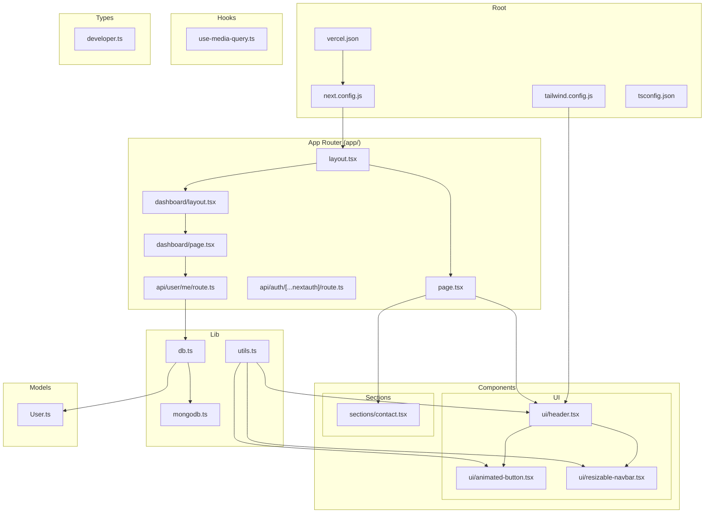
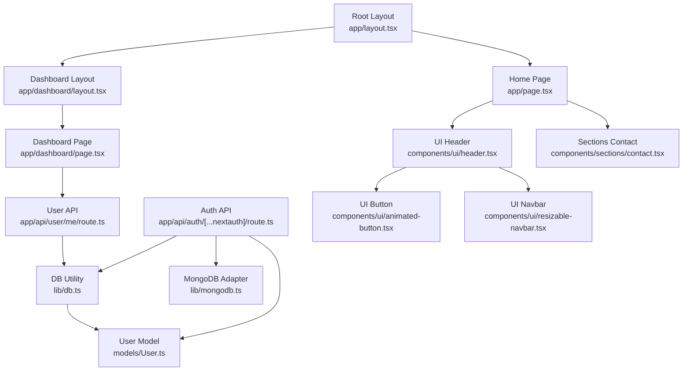
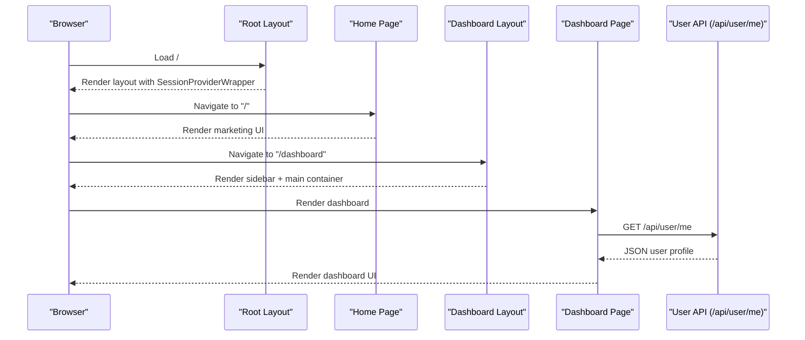
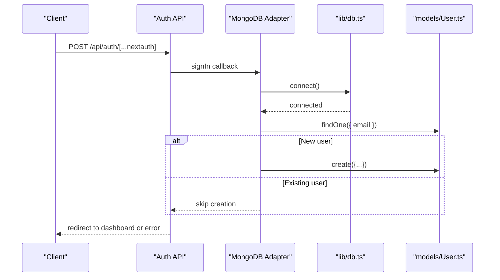
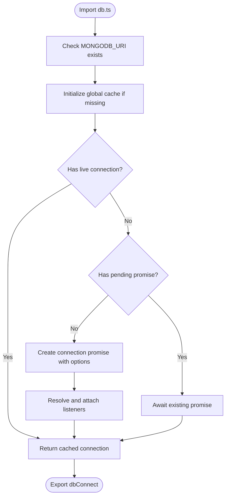
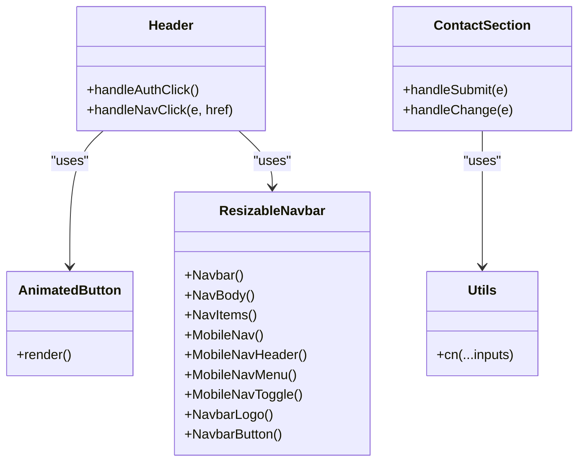
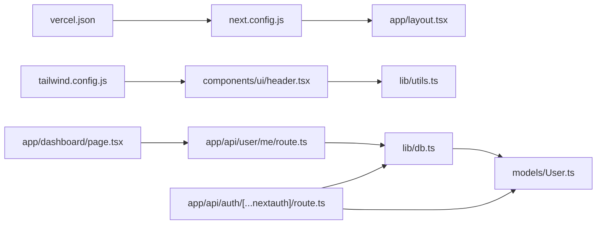

# Directory Structure

<cite>
**Referenced Files in This Document**
- [next.config.js](file://next.config.js)
- [tailwind.config.js](file://tailwind.config.js)
- [vercel.json](file://vercel.json)
- [app/layout.tsx](file://app/layout.tsx)
- [app/dashboard/layout.tsx](file://app/dashboard/layout.tsx)
- [app/page.tsx](file://app/page.tsx)
- [app/dashboard/page.tsx](file://app/dashboard/page.tsx)
- [app/api/auth/[...nextauth]/route.ts](file://app/api/auth/[...nextauth]/route.ts)
- [app/api/user/me/route.ts](file://app/api/user/me/route.ts)
- [lib/db.ts](file://lib/db.ts)
- [lib/utils.ts](file://lib/utils.ts)
- [lib/mongodb.ts](file://lib/mongodb.ts)
- [models/User.ts](file://models/User.ts)
- [components/ui/header.tsx](file://components/ui/header.tsx)
- [components/ui/resizable-navbar.tsx](file://components/ui/resizable-navbar.tsx)
- [components/ui/animated-button.tsx](file://components/ui/animated-button.tsx)
- [components/sections/contact.tsx](file://components/sections/contact.tsx)
- [hooks/use-media-query.ts](file://hooks/use-media-query.ts)
- [types/developer.ts](file://types/developer.ts)
</cite>

## Table of Contents
1. [Introduction](#introduction)
2. [Project Structure](#project-structure)
3. [Core Components](#core-components)
4. [Architecture Overview](#architecture-overview)
5. [Detailed Component Analysis](#detailed-component-analysis)
6. [Dependency Analysis](#dependency-analysis)
7. [Performance Considerations](#performance-considerations)
8. [Troubleshooting Guide](#troubleshooting-guide)
9. [Conclusion](#conclusion)
10. [Appendices](#appendices)

## Introduction
This section documents the project’s file organization and directory structure. It explains how top-level directories are organized, how the Next.js App Router is structured, and how reusable UI is separated into marketing and application categories. It also covers configuration files and provides guidance for adding new features while preserving consistency and developer experience.

## Project Structure
The repository follows a modern Next.js App Router layout with clear separation of concerns:
- app/: Pages, API routes, and shared layouts
- components/: Reusable UI split into marketing sections and application UI
- lib/: Utilities and database connections
- models/: MongoDB Mongoose schemas
- hooks/: Custom React hooks
- types/: TypeScript type definitions
- Configuration files at the root for Next.js, Tailwind CSS, and Vercel deployment

**Diagram sources**
- [next.config.js](file://next.config.js#L1-L10)
- [tailwind.config.js](file://tailwind.config.js#L1-L26)
- [vercel.json](file://vercel.json#L1-L8)
- [app/layout.tsx](file://app/layout.tsx#L1-L43)
- [app/page.tsx](file://app/page.tsx#L1-L514)
- [app/dashboard/layout.tsx](file://app/dashboard/layout.tsx#L1-L20)
- [app/dashboard/page.tsx](file://app/dashboard/page.tsx#L1-L572)
- [app/api/auth/[...nextauth]/route.ts](file://app/api/auth/[...nextauth]/route.ts#L1-L104)
- [app/api/user/me/route.ts](file://app/api/user/me/route.ts#L1-L178)
- [lib/db.ts](file://lib/db.ts#L1-L80)
- [lib/mongodb.ts](file://lib/mongodb.ts)
- [lib/utils.ts](file://lib/utils.ts#L1-L6)
- [models/User.ts](file://models/User.ts#L1-L203)
- [components/ui/header.tsx](file://components/ui/header.tsx#L1-L289)
- [components/ui/animated-button.tsx](file://components/ui/animated-button.tsx#L1-L58)
- [components/ui/resizable-navbar.tsx](file://components/ui/resizable-navbar.tsx#L1-L285)
- [components/sections/contact.tsx](file://components/sections/contact.tsx#L1-L323)
- [hooks/use-media-query.ts](file://hooks/use-media-query.ts#L1-L23)
- [types/developer.ts](file://types/developer.ts#L1-L13)

**Section sources**
- [next.config.js](file://next.config.js#L1-L10)
- [tailwind.config.js](file://tailwind.config.js#L1-L26)
- [vercel.json](file://vercel.json#L1-L8)
- [app/layout.tsx](file://app/layout.tsx#L1-L43)
- [app/dashboard/layout.tsx](file://app/dashboard/layout.tsx#L1-L20)
- [lib/db.ts](file://lib/db.ts#L1-L80)
- [models/User.ts](file://models/User.ts#L1-L203)
- [hooks/use-media-query.ts](file://hooks/use-media-query.ts#L1-L23)
- [types/developer.ts](file://types/developer.ts#L1-L13)

## Core Components
- app/: Contains the Next.js App Router pages and API routes. It includes the root layout, marketing home page, dashboard with nested layout and page, and API handlers for authentication and user data.
- components/: Holds reusable UI. The ui/ folder contains application UI components (e.g., header, animated-button, resizable-navbar), while sections/ contains marketing page components (e.g., contact).
- lib/: Provides database connection utilities and shared helpers. db.ts manages a persistent Mongoose connection with caching and reconnection logic; utils.ts merges Tailwind classes safely.
- models/: Defines Mongoose schemas for domain entities (e.g., User).
- hooks/: Custom React hooks (e.g., media query hook).
- types/: Strongly typed interfaces (e.g., Developer).
- Configuration files: next.config.js, tailwind.config.js, vercel.json define framework behavior, styling, and deployment.

**Section sources**
- [app/page.tsx](file://app/page.tsx#L1-L514)
- [app/dashboard/page.tsx](file://app/dashboard/page.tsx#L1-L572)
- [components/ui/header.tsx](file://components/ui/header.tsx#L1-L289)
- [components/sections/contact.tsx](file://components/sections/contact.tsx#L1-L323)
- [lib/db.ts](file://lib/db.ts#L1-L80)
- [lib/utils.ts](file://lib/utils.ts#L1-L6)
- [models/User.ts](file://models/User.ts#L1-L203)
- [hooks/use-media-query.ts](file://hooks/use-media-query.ts#L1-L23)
- [types/developer.ts](file://types/developer.ts#L1-L13)

## Architecture Overview
The system uses Next.js App Router with a root layout and nested dashboard layout. Authentication integrates with NextAuth and MongoDB via a provider adapter. API routes under app/api handle OAuth flows and user profile operations. UI components are composed from reusable building blocks in components/.

**Diagram sources**
- [app/layout.tsx](file://app/layout.tsx#L1-L43)
- [app/page.tsx](file://app/page.tsx#L1-L514)
- [app/dashboard/layout.tsx](file://app/dashboard/layout.tsx#L1-L20)
- [app/dashboard/page.tsx](file://app/dashboard/page.tsx#L1-L572)
- [app/api/auth/[...nextauth]/route.ts](file://app/api/auth/[...nextauth]/route.ts#L1-L104)
- [app/api/user/me/route.ts](file://app/api/user/me/route.ts#L1-L178)
- [lib/db.ts](file://lib/db.ts#L1-L80)
- [lib/mongodb.ts](file://lib/mongodb.ts)
- [models/User.ts](file://models/User.ts#L1-L203)
- [components/ui/header.tsx](file://components/ui/header.tsx#L1-L289)
- [components/ui/animated-button.tsx](file://components/ui/animated-button.tsx#L1-L58)
- [components/ui/resizable-navbar.tsx](file://components/ui/resizable-navbar.tsx#L1-L285)
- [components/sections/contact.tsx](file://components/sections/contact.tsx#L1-L323)

## Detailed Component Analysis

### App Router Structure
- Root layout: Sets global metadata, fonts, favicon, and wraps children in a session provider.
- Home page: Marketing-centric page importing UI and sections.
- Dashboard layout: Provides a sidebar and main content container for authenticated views.
- Dashboard page: Fetches user data, triggers AI analysis for innovators, and renders stats and teams.

**Diagram sources**
- [app/layout.tsx](file://app/layout.tsx#L1-L43)
- [app/page.tsx](file://app/page.tsx#L1-L514)
- [app/dashboard/layout.tsx](file://app/dashboard/layout.tsx#L1-L20)
- [app/dashboard/page.tsx](file://app/dashboard/page.tsx#L1-L572)
- [app/api/user/me/route.ts](file://app/api/user/me/route.ts#L1-L178)

**Section sources**
- [app/layout.tsx](file://app/layout.tsx#L1-L43)
- [app/page.tsx](file://app/page.tsx#L1-L514)
- [app/dashboard/layout.tsx](file://app/dashboard/layout.tsx#L1-L20)
- [app/dashboard/page.tsx](file://app/dashboard/page.tsx#L1-L572)

### Authentication Flow
- NextAuth handles Google OAuth and persists sessions in MongoDB using the adapter.
- On sign-in, a new user may be created if not present; session and JWT callbacks enrich the session with user data.

**Diagram sources**
- [app/api/auth/[...nextauth]/route.ts](file://app/api/auth/[...nextauth]/route.ts#L1-L104)
- [lib/db.ts](file://lib/db.ts#L1-L80)
- [models/User.ts](file://models/User.ts#L1-L203)

**Section sources**
- [app/api/auth/[...nextauth]/route.ts](file://app/api/auth/[...nextauth]/route.ts#L1-L104)
- [lib/db.ts](file://lib/db.ts#L1-L80)
- [models/User.ts](file://models/User.ts#L1-L203)

### Database Connection and Schema
- db.ts establishes a cached Mongoose connection with robust error handling and reconnection logic.
- User model defines roles, profiles, project requirements, performance metrics, and indexes for efficient queries.

**Diagram sources**
- [lib/db.ts](file://lib/db.ts#L1-L80)
- [models/User.ts](file://models/User.ts#L1-L203)

**Section sources**
- [lib/db.ts](file://lib/db.ts#L1-L80)
- [models/User.ts](file://models/User.ts#L1-L203)

### UI Component Hierarchy
- components/ui/: Application UI components (header, animated-button, resizable-navbar) are used across pages and dashboards.
- components/sections/: Marketing UI components (contact) are used on the home page.
- Shared utility function cn() merges Tailwind classes safely.

**Diagram sources**
- [components/ui/header.tsx](file://components/ui/header.tsx#L1-L289)
- [components/ui/animated-button.tsx](file://components/ui/animated-button.tsx#L1-L58)
- [components/ui/resizable-navbar.tsx](file://components/ui/resizable-navbar.tsx#L1-L285)
- [components/sections/contact.tsx](file://components/sections/contact.tsx#L1-L323)
- [lib/utils.ts](file://lib/utils.ts#L1-L6)

**Section sources**
- [components/ui/header.tsx](file://components/ui/header.tsx#L1-L289)
- [components/ui/animated-button.tsx](file://components/ui/animated-button.tsx#L1-L58)
- [components/ui/resizable-navbar.tsx](file://components/ui/resizable-navbar.tsx#L1-L285)
- [components/sections/contact.tsx](file://components/sections/contact.tsx#L1-L323)
- [lib/utils.ts](file://lib/utils.ts#L1-L6)

## Dependency Analysis
- Configuration dependencies:
  - next.config.js controls runtime behavior and image handling.
  - tailwind.config.js scopes content scanning and extends animations and keyframes.
  - vercel.json defines build/dev commands and framework settings for deployment.
- Runtime dependencies:
  - app/layout.tsx imports global styles and a session wrapper.
  - components/ui/header.tsx depends on utils.cn and animation libraries.
  - app/dashboard/page.tsx depends on app/api/user/me/route.ts for user data.
  - app/api/auth/[...nextauth]/route.ts depends on lib/db.ts and models/User.ts for persistence.

**Diagram sources**
- [next.config.js](file://next.config.js#L1-L10)
- [tailwind.config.js](file://tailwind.config.js#L1-L26)
- [vercel.json](file://vercel.json#L1-L8)
- [app/layout.tsx](file://app/layout.tsx#L1-L43)
- [components/ui/header.tsx](file://components/ui/header.tsx#L1-L289)
- [lib/utils.ts](file://lib/utils.ts#L1-L6)
- [app/dashboard/page.tsx](file://app/dashboard/page.tsx#L1-L572)
- [app/api/user/me/route.ts](file://app/api/user/me/route.ts#L1-L178)
- [lib/db.ts](file://lib/db.ts#L1-L80)
- [models/User.ts](file://models/User.ts#L1-L203)
- [app/api/auth/[...nextauth]/route.ts](file://app/api/auth/[...nextauth]/route.ts#L1-L104)

**Section sources**
- [next.config.js](file://next.config.js#L1-L10)
- [tailwind.config.js](file://tailwind.config.js#L1-L26)
- [vercel.json](file://vercel.json#L1-L8)
- [app/layout.tsx](file://app/layout.tsx#L1-L43)
- [components/ui/header.tsx](file://components/ui/header.tsx#L1-L289)
- [lib/utils.ts](file://lib/utils.ts#L1-L6)
- [app/dashboard/page.tsx](file://app/dashboard/page.tsx#L1-L572)
- [app/api/user/me/route.ts](file://app/api/user/me/route.ts#L1-L178)
- [lib/db.ts](file://lib/db.ts#L1-L80)
- [models/User.ts](file://models/User.ts#L1-L203)
- [app/api/auth/[...nextauth]/route.ts](file://app/api/auth/[...nextauth]/route.ts#L1-L104)

## Performance Considerations
- Database connection caching reduces repeated connection overhead and reconnects gracefully on disconnects.
- Tailwind content scanning is scoped to app/, pages/, and components/ to keep builds fast.
- Next.js image optimization is disabled to support static export scenarios; ensure assets are optimized externally if needed.
- Dashboard page performs a single user fetch and conditionally triggers AI analysis to minimize redundant network calls.

[No sources needed since this section provides general guidance]

## Troubleshooting Guide
- Authentication issues:
  - Verify environment variables for Google OAuth and MongoDB are configured.
  - Check NextAuth callbacks for errors during sign-in and session enrichment.
- Database connectivity:
  - Confirm MONGODB_URI is set and db.ts logs indicate successful connection.
  - Review connection status and error listeners for disconnections.
- API errors:
  - For /api/user/me, ensure a valid JWT token is present in cookies and verify token signature.
  - Inspect user model queries and indexes for performance.

**Section sources**
- [app/api/auth/[...nextauth]/route.ts](file://app/api/auth/[...nextauth]/route.ts#L1-L104)
- [lib/db.ts](file://lib/db.ts#L1-L80)
- [app/api/user/me/route.ts](file://app/api/user/me/route.ts#L1-L178)

## Conclusion
The project’s directory structure cleanly separates concerns: pages and API routes under app/, reusable UI under components/, database logic under lib/, and domain models under models/. Configuration files at the root tailor Next.js, Tailwind, and Vercel behavior. The App Router enables a clear root and dashboard layout hierarchy, while UI components are modular and composable. Following the naming and placement conventions outlined here will help maintain consistency and scalability.

## Appendices

### File Path Conventions and Naming Patterns
- Pages and API routes:
  - app/page.tsx, app/dashboard/page.tsx, app/dashboard/layout.tsx
  - app/api/user/me/route.ts, app/api/auth/[...nextauth]/route.ts
- UI components:
  - components/ui/header.tsx, components/ui/animated-button.tsx, components/ui/resizable-navbar.tsx
  - components/sections/contact.tsx
- Utilities and database:
  - lib/utils.ts, lib/db.ts, lib/mongodb.ts
- Models:
  - models/User.ts
- Hooks and types:
  - hooks/use-media-query.ts, types/developer.ts

Guidance for new features:
- Pages: Place under app/ with appropriate nesting (e.g., app/signup/page.tsx).
- API routes: Add under app/api/<resource>/<action>/route.ts or use dynamic segments as needed.
- UI: Put reusable application UI in components/ui/ and marketing UI in components/sections/.
- Database: Extend models/ with new schemas and update lib/db.ts if connection behavior changes.
- Types: Add new interfaces under types/.

[No sources needed since this section provides general guidance]