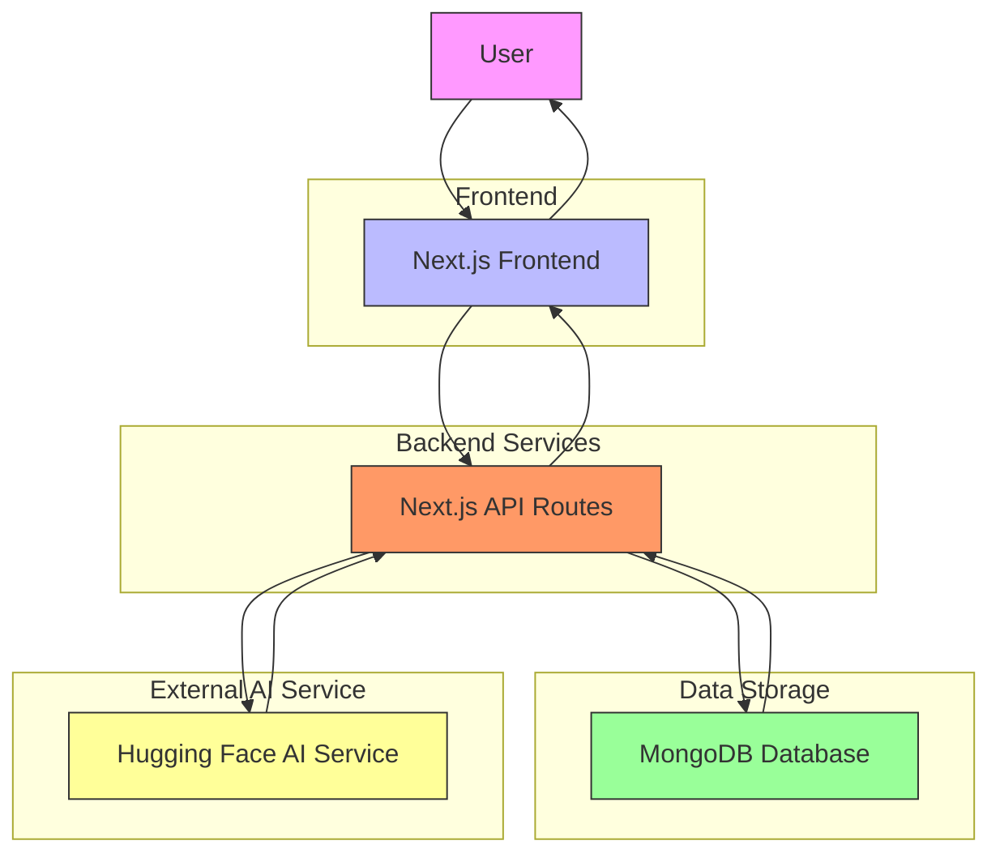

# System Overview

<cite>
**Referenced Files in This Document**   
- [page.tsx](file://app/page.tsx)
- [User.ts](file://models/User.ts)
- [Project.ts](file://models/Project.ts)
- [db.ts](file://lib/db.ts)
- [mongodb.ts](file://lib/mongodb.ts)
- [middleware.ts](file://middleware.ts)
- [route.ts](file://app/api/auth/signup/route.ts)
- [route.ts](file://app/api/auth/login/route.ts)
- [route.ts](file://app/api/project/analyze/route.ts)
- [route.ts](file://app/api/user/me/route.ts)
- [route.ts](file://app/api/user/team/route.ts)
- [route.ts](file://app/api/user/performance/route.ts)
- [route.ts](file://app/api/user/assign-mentor/route.ts)
- [route.ts](file://app/api/test-huggingface/route.ts)
</cite>

## Table of Contents
1. [Introduction](#introduction)
2. [Core Purpose and Value Proposition](#core-purpose-and-value-proposition)
3. [High-Level Architecture](#high-level-architecture)
4. [Core User Workflows](#core-user-workflows)
5. [AI-Powered Matching System](#ai-powered-matching-system)
6. [User Roles and Profiles](#user-roles-and-profiles)
7. [Data Models](#data-models)
8. [Real-World Usage Scenarios](#real-world-usage-scenarios)
9. [Key Differentiators](#key-differentiators)
10. [System Context Diagram](#system-context-diagram)

## Introduction

The creatorsmeet-2 platform is an AI-powered ecosystem designed to bridge the gap between innovators with ideas and developers with technical expertise. This document provides a comprehensive overview of the system, detailing its architecture, workflows, and unique value proposition in connecting creative minds with technical talent to bring innovative projects to life.

**Section sources**
- [page.tsx](file://app/page.tsx)

## Core Purpose and Value Proposition

CreatorsMeet-2 serves as a specialized matching platform that connects innovators seeking to develop their ideas with skilled developers who can implement them. The platform's primary value lies in its AI-driven approach to project analysis and team formation, which significantly increases the success rate of collaborations.

For **innovators**, the platform offers:
- AI-powered analysis of project ideas to identify required technologies and complexity
- Smart matching with developers based on technical skills and project requirements
- Access to AI mentors for guidance throughout the development process
- Performance tracking to monitor project progress and team collaboration

For **developers**, the platform provides:
- Opportunities to work on innovative projects aligned with their skill sets
- AI-assisted recommendations for technology stacks and implementation approaches
- Structured collaboration tools and project management features
- Performance metrics that build their professional reputation on the platform

The platform's success is evidenced by metrics displayed on the homepage, including over 10,000 active users, 500+ projects built, a 98% success rate, and participation from 50+ countries.

**Section sources**
- [page.tsx](file://app/page.tsx)

## High-Level Architecture

The creatorsmeet-2 platform follows a modern full-stack architecture with distinct frontend, backend, and data persistence layers, integrated with external AI services.

### Technology Stack
- **Frontend**: Next.js 14 with React, utilizing App Router, Server Components, and React Server Components for optimal performance
- **Styling**: Tailwind CSS with additional UI libraries for enhanced visual components
- **Backend**: Next.js API routes for server-side logic and data processing
- **Database**: MongoDB for data persistence, accessed through Mongoose ODM
- **Authentication**: JWT-based authentication with secure cookie storage
- **AI Integration**: Hugging Face Inference API for natural language processing and project analysis
- **Deployment**: Vercel platform for hosting and serverless function execution

### Component Interactions
The system operates through a series of well-defined interactions:
1. Users interact with the Next.js frontend components
2. Frontend makes API calls to Next.js server routes
3. Server routes process requests, authenticate users, and interact with MongoDB
4. For AI analysis, server routes call the Hugging Face API to analyze project requirements
5. Data flows back through the API to update the frontend state

This architecture enables server-side rendering for SEO benefits while maintaining interactive client-side experiences through React components.

**Section sources**
- [page.tsx](file://app/page.tsx)
- [db.ts](file://lib/db.ts)
- [mongodb.ts](file://lib/mongodb.ts)
- [middleware.ts](file://middleware.ts)
- [package.json](file://package.json)

## Core User Workflows

### Project Submission
Innovators begin by submitting their project ideas through the platform. The workflow involves:
1. User authentication and role selection
2. Submission of a detailed project description
3. AI analysis of the project requirements
4. Generation of technology recommendations and complexity assessment
5. Storage of analyzed project data in the user profile

This process is facilitated by the `/api/project/analyze` endpoint, which uses Hugging Face to analyze the project description and identify relevant technologies, complexity level, and required expertise.

### AI-Driven Technology Recommendations
When a project idea is submitted, the system performs AI analysis to extract key information:
1. The project description is sent to the Hugging Face API using zero-shot classification
2. The system first identifies relevant technology categories (frontend, backend, database, etc.)
3. Based on the identified categories, specific technologies are recommended
4. Project complexity is assessed on a scale of Simple, Moderate, Complex, or Very Complex
5. Required expertise is categorized into Technical Architecture, Product Development, AI/ML Development, Mobile Development, or Web Development

These recommendations are then used to match innovators with suitable developers.

### User Authentication
The platform implements a secure authentication system with the following workflow:
1. Users sign up with name, email, password, role, and country
2. Passwords are hashed using bcrypt before storage
3. Upon successful authentication, a JWT token is generated and stored in an HTTP-only cookie
4. The middleware checks for valid tokens on protected routes
5. Token-based authentication enables access to user-specific data and features

The authentication flow is managed through dedicated API routes for signup, login, and session management.

### Team Formation
The team formation process leverages AI analysis to create effective partnerships:
1. Innovators submit project requirements which are analyzed for technology needs
2. Developers specify their technical skills and expertise
3. The system matches innovators with developers based on compatibility between project requirements and developer skills
4. Once matched, users can collaborate through the platform's team features
5. The match is stored in the user records, enabling team communication and project tracking

### Dashboard Interactions
Authenticated users access a comprehensive dashboard with multiple features:
- **Profile Management**: Users can view and update their personal information, skills, and social links
- **Performance Tracking**: Real-time metrics on project progress, task completion, and team collaboration
- **Team Collaboration**: Access to matched team members and communication tools
- **AI Mentor Access**: Connection to AI mentors who provide guidance based on the user's role and project needs

The dashboard serves as the central hub for ongoing projects and collaboration.

**Section sources**
- [route.ts](file://app/api/auth/signup/route.ts)
- [route.ts](file://app/api/auth/login/route.ts)
- [route.ts](file://app/api/project/analyze/route.ts)
- [route.ts](file://app/api/user/me/route.ts)
- [route.ts](file://app/api/user/team/route.ts)
- [route.ts](file://app/api/user/performance/route.ts)

## AI-Powered Matching System

The core innovation of creatorsmeet-2 lies in its AI-powered matching system, which goes beyond simple keyword matching to create meaningful connections between innovators and developers.

### Project Analysis Process
The AI analysis workflow follows these steps:
1. **Category Identification**: The system first determines which technology domains are relevant to the project (e.g., frontend, backend, database)
2. **Technology Recommendation**: Based on the identified categories, specific technologies are recommended using zero-shot classification
3. **Complexity Assessment**: The project description is analyzed to determine its complexity level
4. **Expertise Classification**: The system identifies the primary expertise required for successful project completion

This multi-step analysis ensures that project requirements are thoroughly understood before matching occurs.

### AI Mentor Assignment
The platform enhances collaboration through AI mentor assignment:
- Four specialized AI mentors are available, each with different expertise areas
- **TechGuide AI**: Focuses on software architecture and development best practices
- **ProjectPro AI**: Specializes in project planning and management methodologies
- **InnovateMind AI**: Helps refine ideas and develop market-ready solutions
- **CodeCraft AI**: Expert in modern development practices and technical implementation

Mentors are assigned based on user role:
- Innovators are matched with mentors who can help refine their ideas and develop business strategies
- Developers are paired with mentors who can provide technical guidance and code review suggestions

The mentor assignment system is accessible through the `/api/user/assign-mentor` endpoint and provides ongoing support throughout the project lifecycle.

### Performance Tracking
The platform includes comprehensive performance tracking to enhance collaboration:
- **Communication Score**: Measures responsiveness and clarity in team interactions
- **Collaboration Score**: Evaluates teamwork and contribution to shared goals
- **Delivery Speed**: Tracks progress against project timelines
- **Code Quality**: Assesses technical implementation and best practices

These metrics are updated regularly and provide valuable feedback for improving team dynamics and project outcomes.

**Section sources**
- [route.ts](file://app/api/project/analyze/route.ts)
- [route.ts](file://app/api/user/assign-mentor/route.ts)
- [route.ts](file://app/api/user/performance/route.ts)
- [User.ts](file://models/User.ts)

## User Roles and Profiles

The platform supports multiple user roles, each with specific capabilities and data requirements.

### User Roles
- **Innovator**: Users with project ideas who need developers to implement them
- **Coder**: Developers with technical skills who can build projects
- **Mentor**: Experienced professionals who provide guidance (not currently implemented in the UI)
- **Company**: Organizations seeking to develop projects (not currently implemented in the UI)

### Profile Structure
User profiles contain comprehensive information to facilitate effective matching:
- **Basic Information**: Name, email, country, profile image
- **Professional Details**: Bio, GitHub and LinkedIn links
- **Skills**: Technical skills for developers, or project interests for innovators
- **Project Requirements**: For innovators, including project description, desired technologies, complexity level, and expertise needs
- **Performance Metrics**: Collaboration scores and project progress tracking
- **AI Mentor**: Assigned AI mentor with expertise and avatar

The profile system is designed to capture sufficient information for intelligent matching while remaining user-friendly.

**Section sources**
- [User.ts](file://models/User.ts)
- [route.ts](file://app/api/user/me/route.ts)

## Data Models

The platform's data architecture is built around two primary models: User and Project.

### User Model
The User model contains comprehensive information about platform participants:
- **Authentication Data**: Name, email, hashed password
- **Role Information**: User type (innovator, coder, etc.)
- **Profile Details**: Bio, skills, country, social links, profile image
- **Project Requirements**: For innovators, storing analyzed project data including technologies, complexity, and expertise
- **Relationships**: Reference to matched user and active project
- **Performance Data**: Collaboration metrics and scores
- **AI Mentor**: Embedded document with mentor assignment details
- **Timestamps**: Creation and update times with virtual "joinedAt" field

The model includes indexes on key fields like role and project requirements to optimize query performance.

### Project Model
The Project model tracks development initiatives from conception to completion:
- **Project Details**: Name, description, status (planning, in-progress, completed, on-hold)
- **Team Members**: References to innovator and developer
- **Financial Information**: Budget range with currency specification
- **Technical Requirements**: List of required technologies
- **Timeline**: Start and end dates
- **Progress Tracking**: Percentage completion
- **Milestones**: Key project checkpoints with status and dates
- **Tasks**: Individual work items with assignments and status tracking

The model supports comprehensive project management with built-in progress tracking.

Both models include middleware to automatically update timestamps on document modification.

**Section sources**
- [User.ts](file://models/User.ts)
- [Project.ts](file://models/Project.ts)

## Real-World Usage Scenarios

### Scenario 1: Startup Founder Seeking Development Help
Sarah, a product designer with an innovative SaaS idea, joins the platform as an innovator. She describes her project concept, which the AI analyzes to recommend a technology stack of Next.js, React, and MongoDB. The system matches her with Mike, a full-stack developer experienced with this stack. They collaborate through the platform, with Sarah receiving guidance from InnovateMind AI on product development strategy, while Mike consults with TechGuide AI on architectural decisions. Their progress is tracked through the dashboard, showing a steady increase in project completion percentage.

### Scenario 2: Developer Expanding Portfolio
Mike, an experienced full-stack developer, joins the platform to work on innovative projects. He specifies his expertise in JavaScript, React, and Node.js. The platform matches him with several innovators, including Sarah. As he completes projects successfully, his performance metrics improve, making him more attractive to future collaborators. He uses the CodeCraft AI mentor to stay updated on the latest development practices and receives constructive feedback on his implementations.

### Scenario 3: Cross-Border Collaboration
Emily, a startup founder in the United States, connects with a developer in India through the platform. Despite the geographical distance, they collaborate effectively using the platform's tools. The AI analysis ensures they have compatible technical expectations, while the performance tracking system provides transparency into work progress. Their successful collaboration results in a product with over 1,000 users, demonstrating the platform's ability to facilitate global innovation.

**Section sources**
- [page.tsx](file://app/page.tsx)

## Key Differentiators

CreatorsMeet-2 distinguishes itself from traditional developer matching platforms through several innovative features:

### AI-Powered Project Analysis
Unlike platforms that rely solely on user-provided tags or keywords, creatorsmeet-2 uses natural language processing to analyze project descriptions and extract meaningful technical requirements. This reduces the burden on users to precisely articulate their needs while improving matching accuracy.

### Dynamic Technology Recommendations
The system doesn't just match based on current skills but also suggests emerging technologies that might be suitable for a project. This helps innovators stay current with technological trends and enables developers to expand their skill sets.

### Integrated AI Mentorship
The platform provides continuous guidance through specialized AI mentors, offering support that extends beyond simple matching. This mentorship system helps both innovators and developers overcome challenges and make informed decisions throughout the development process.

### Comprehensive Performance Tracking
Rather than focusing solely on project completion, the platform tracks multiple dimensions of collaboration quality, providing valuable feedback for improving team dynamics and individual performance.

### End-to-End Collaboration Environment
CreatorsMeet-2 offers a complete ecosystem for project development, from initial idea submission through final delivery, eliminating the need to integrate multiple third-party tools for project management, communication, and code collaboration.

**Section sources**
- [page.tsx](file://app/page.tsx)
- [route.ts](file://app/api/project/analyze/route.ts)
- [route.ts](file://app/api/user/assign-mentor/route.ts)

## System Context Diagram

**Diagram sources**
- [page.tsx](file://app/page.tsx)
- [db.ts](file://lib/db.ts)
- [route.ts](file://app/api/project/analyze/route.ts)

**Section sources**
- [page.tsx](file://app/page.tsx)
- [db.ts](file://lib/db.ts)
- [route.ts](file://app/api/project/analyze/route.ts)