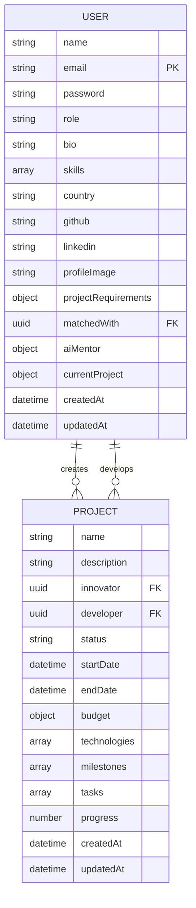
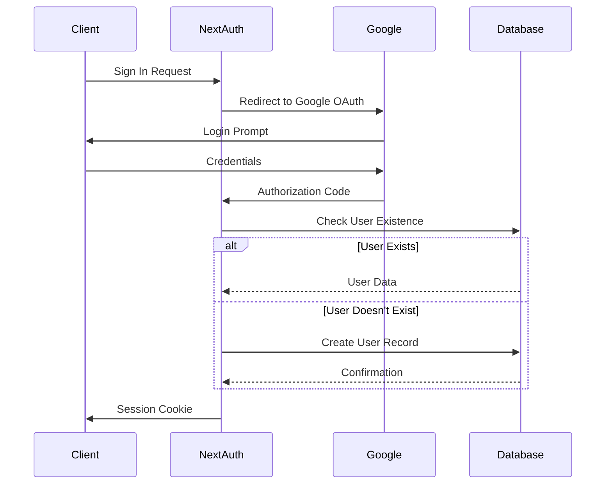
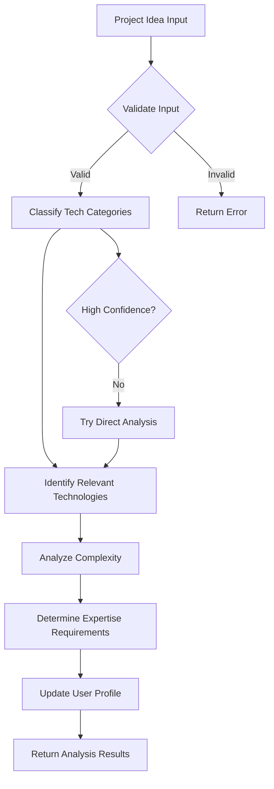
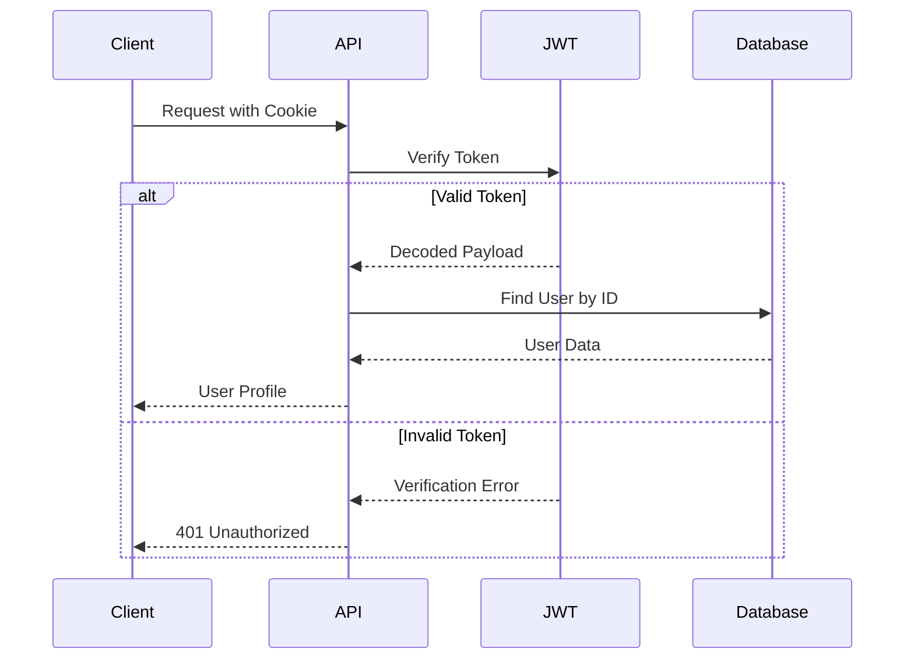
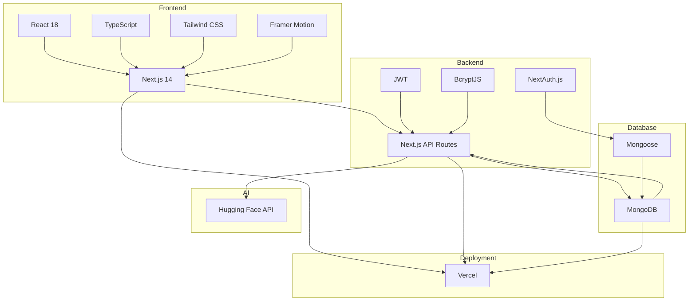

# Technology Stack

<cite>
**Referenced Files in This Document**   
- [package.json](file://package.json)
- [next.config.js](file://next.config.js)
- [tsconfig.json](file://tsconfig.json)
- [tailwind.config.js](file://tailwind.config.js)
- [tailwind.config.ts](file://tailwind.config.ts)
- [vercel.json](file://vercel.json)
- [lib/db.ts](file://lib/db.ts)
- [lib/mongodb.ts](file://lib/mongodb.ts)
- [models/User.ts](file://models/User.ts)
- [models/Project.ts](file://models/Project.ts)
- [app/api/auth/[...nextauth]/route.ts](file://app/api/auth/[...nextauth]/route.ts)
- [app/api/user/me/route.ts](file://app/api/user/me/route.ts)
- [app/api/project/analyze/route.ts](file://app/api/project/analyze/route.ts)
- [app/api/test-huggingface/route.ts](file://app/api/test-huggingface/route.ts)
- [middleware.ts](file://middleware.ts)
- [app/SessionProviderWrapper.tsx](file://app/SessionProviderWrapper.tsx)
</cite>

## Table of Contents
1. [Frontend Architecture](#frontend-architecture)
2. [Backend and API Layer](#backend-and-api-layer)
3. [Database and Data Modeling](#database-and-data-modeling)
4. [Authentication System](#authentication-system)
5. [AI Integration](#ai-integration)
6. [Security and Token Management](#security-and-token-management)
7. [Styling and UI Components](#styling-and-ui-components)
8. [Deployment and Infrastructure](#deployment-and-infrastructure)
9. [Technology Integration Overview](#technology-integration-overview)

## Frontend Architecture

The frontend of creatorsmeet-2 is built using Next.js 14 with the App Router, enabling server-side rendering (SSR) and optimized static generation. This architecture ensures fast initial page loads and improved SEO performance. React 18 provides the component model, leveraging concurrent rendering features for smoother user interactions. TypeScript is used throughout the codebase to enforce type safety, reduce runtime errors, and improve developer experience through better tooling and autocompletion.

The application structure follows a modular approach with components organized in both the `app/components` and `components` directories, allowing for reusable UI elements across different sections of the application. The use of React Server Components enables efficient data fetching and reduces client-side JavaScript bundle size.

**Section sources**
- [package.json](file://package.json#L28-L31)
- [next.config.js](file://next.config.js#L1-L10)
- [tsconfig.json](file://tsconfig.json#L1-L27)

## Backend and API Layer

The backend leverages Next.js API routes within the App Router structure, located in the `app/api` directory. These serverless functions handle various operations including user management, project analysis, and authentication flows. Each API endpoint is implemented as a separate route file, following the route handler pattern introduced in Next.js 13+.

API routes are used for critical operations such as user profile retrieval (`/api/user/me`), project requirement analysis (`/api/project/analyze`), and authentication management. The API layer integrates with MongoDB through Mongoose for data persistence and with external services like Hugging Face for AI-powered analysis.

**Section sources**
- [app/api/user/me/route.ts](file://app/api/user/me/route.ts#L1-L178)
- [app/api/project/analyze/route.ts](file://app/api/project/analyze/route.ts#L1-L309)
- [app/api/test-huggingface/route.ts](file://app/api/test-huggingface/route.ts#L1-L78)

## Database and Data Modeling

The application uses MongoDB as its primary database, connected through Mongoose ODM for schema definition and data validation. Two primary models are defined: User and Project, each with comprehensive schemas that capture the application's domain requirements.

The User model includes fields for personal information, role-based access control, project requirements, performance metrics, and AI mentor assignment. It also features embedded schemas for project milestones, tasks, and performance tracking. The Project model defines relationships between innovators and developers, tracks project status, budget, technologies, and progress metrics.

Database connection is managed through two different approaches: `lib/db.ts` provides a cached Mongoose connection for general use, while `lib/mongodb.ts` exports a native MongoDB client promise specifically designed for NextAuth integration.

**Diagram sources**
- [models/User.ts](file://models/User.ts#L1-L203)
- [models/Project.ts](file://models/Project.ts#L1-L106)
- [lib/db.ts](file://lib/db.ts#L1-L80)
- [lib/mongodb.ts](file://lib/mongodb.ts#L1-L38)

## Authentication System

Authentication is implemented using NextAuth.js, configured with Google OAuth provider and MongoDB adapter for persistent session storage. The authentication configuration is defined in `app/api/auth/[...nextauth]/route.ts`, which exports a NextAuth handler with custom callbacks for signIn, session, and JWT token management.

The system supports both OAuth-based login (via Google) and traditional email/password authentication. Upon first-time Google login, the system automatically creates a user record in MongoDB with default values. The session callback enriches the session object with user role and profile information from the database, while the JWT callback attaches the user ID to the token payload.

**Diagram sources**
- [app/api/auth/[...nextauth]/route.ts](file://app/api/auth/[...nextauth]/route.ts#L1-L104)
- [lib/mongodb.ts](file://lib/mongodb.ts#L1-L38)
- [middleware.ts](file://middleware.ts#L1-L30)

## AI Integration

The application integrates with the Hugging Face Inference API to provide AI-powered project analysis capabilities. This integration is implemented in the `/api/project/analyze` route, which uses the Facebook BART large MNLI model for zero-shot classification of project ideas.

The AI analysis workflow categorizes project descriptions into technology domains (frontend, backend, database, etc.), identifies recommended technologies, determines project complexity, and suggests required expertise areas. The system implements fallback mechanisms and mock responses for development environments where the Hugging Face API key may not be available.

**Diagram sources**
- [app/api/project/analyze/route.ts](file://app/api/project/analyze/route.ts#L1-L309)
- [app/api/test-huggingface/route.ts](file://app/api/test-huggingface/route.ts#L1-L78)

## Security and Token Management

Security is implemented through multiple layers including JWT-based authentication, password hashing with BcryptJS, and environment variable protection. The application uses JWT tokens stored in HTTP-only cookies for session management, providing protection against XSS attacks.

The `/api/user/me` endpoint demonstrates the token verification process, where incoming requests are validated using the JWT secret before accessing protected user data. Passwords are hashed using BcryptJS before storage in the database, ensuring that plain text passwords are never persisted.

**Diagram sources**
- [app/api/user/me/route.ts](file://app/api/user/me/route.ts#L1-L178)
- [package.json](file://package.json#L20-L21)
- [middleware.ts](file://middleware.ts#L1-L30)

## Styling and UI Components

The application uses Tailwind CSS for utility-first styling, configured with both `tailwind.config.js` and `tailwind.config.ts` files. This dual configuration allows for type-safe theme customization while maintaining compatibility with the build system.

Custom animations are defined in the Tailwind configuration, including a slow spin animation and a floating effect used throughout the UI. The application also incorporates several UI component libraries including @heroicons/react, lucide-react, and @tabler/icons-react for consistent iconography.

The component structure includes reusable UI elements in the `components/ui` directory and page-specific components in the `app/components` directory. These components leverage framer-motion for advanced animations and interactions, enhancing the user experience.

**Section sources**
- [tailwind.config.js](file://tailwind.config.js#L1-L26)
- [tailwind.config.ts](file://tailwind.config.ts#L1-L24)
- [package.json](file://package.json#L12-L13)
- [components/ui](file://components/ui)

## Deployment and Infrastructure

The application is configured for deployment on Vercel, as indicated by the `vercel.json` configuration file. The deployment configuration specifies the build command, development command, and framework type, ensuring proper deployment settings.

The application is designed to run as serverless functions on Vercel's edge network, with API routes automatically deployed as serverless endpoints. The configuration also specifies the deployment region (iad1), optimizing performance for users in that geographic area.

Environment variables are managed through `.env.production` and local environment files, with critical secrets such as database URIs, JWT secrets, and API keys protected from exposure.

**Section sources**
- [vercel.json](file://vercel.json#L1-L8)
- [.env.production](file://.env.production)
- [next.config.js](file://next.config.js#L1-L10)

## Technology Integration Overview

The full-stack architecture of creatorsmeet-2 demonstrates a cohesive integration of modern web technologies. The frontend, built with Next.js 14 and React 18, communicates with backend API routes that process business logic and interact with MongoDB for data persistence.

Authentication flows through NextAuth.js with MongoDB adapter ensure secure user management, while JWT tokens provide stateless session verification. The AI analysis feature leverages Hugging Face's inference API to deliver intelligent project recommendations, demonstrating the application's advanced capabilities.

All technologies are version-compatible, with dependencies specified in package.json ensuring consistent development and production environments. The TypeScript configuration provides type safety across the entire stack, from frontend components to backend API handlers and database models.

**Diagram sources**
- [package.json](file://package.json#L1-L47)
- [next.config.js](file://next.config.js#L1-L10)
- [tsconfig.json](file://tsconfig.json#L1-L27)
- [vercel.json](file://vercel.json#L1-L8)