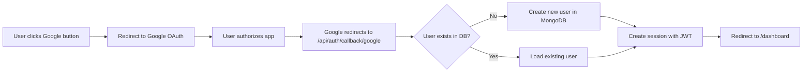

# ✅ Google OAuth Setup Complete for youdex.in

## 🎉 Configuration Status

### ✅ Environment Variables Configured

**`.env.local` (Local Development):**
```env
NEXTAUTH_URL="http://localhost:3000"
NEXTAUTH_SECRET="[your-generated-secret]"
GOOGLE_CLIENT_ID="[your-google-client-id]"
GOOGLE_CLIENT_SECRET="[your-google-client-secret]"
```

**`.env.production` (Production on youdex.in):**
```env
NEXTAUTH_URL="https://youdex.in"
NEXTAUTH_SECRET="[your-generated-secret]"
GOOGLE_CLIENT_ID="[your-google-client-id]"
GOOGLE_CLIENT_SECRET="[your-google-client-secret]"
```

---

## 📋 Remaining Steps

### 1️⃣ Install Required Package
```bash
npm install @auth/mongodb-adapter
```

### 2️⃣ Add Environment Variables to Vercel

Go to your Vercel Dashboard → Your Project → Settings → Environment Variables

Add these **4 variables**:

| Variable Name | Value | Environment |
|--------------|-------|-------------|
| `NEXTAUTH_URL` | `https://youdex.in` | Production |
| `NEXTAUTH_SECRET` | `[your-generated-secret]` | Production, Preview, Development |
| `GOOGLE_CLIENT_ID` | `[your-google-client-id]` | Production, Preview, Development |
| `GOOGLE_CLIENT_SECRET` | `[your-google-client-secret]` | Production, Preview, Development |

### 3️⃣ Verify Google Cloud Console Settings

**Make sure these URLs are added in Google Cloud Console:**

**Authorized JavaScript Origins:**
- ✅ `https://youdex.in`
- ✅ `http://localhost:3000`

**Authorized Redirect URIs:**
- ✅ `https://youdex.in/api/auth/callback/google`
- ✅ `http://localhost:3000/api/auth/callback/google`

### 4️⃣ Test Locally
```bash
npm run dev
```
Then visit: http://localhost:3000/signin and click the Google button

### 5️⃣ Deploy to Production
```bash
git add .
git commit -m "Add Google OAuth integration"
git push
```

Or deploy via Vercel dashboard.

---

## 🔍 What's Already Done

✅ **NextAuth API Route Created**
- `app/api/auth/[...nextauth]/route.ts`
- Handles Google OAuth callback
- Creates user in MongoDB on first login

✅ **Session Provider Added**
- `app/SessionProviderWrapper.tsx`
- Wraps entire app for session management

✅ **Sign-In Page Updated**
- `app/signin/creators/page.tsx`
- Google button with OAuth handler
- Automatic redirect to dashboard

✅ **Environment Variables Set**
- Local and production configs ready
- Google credentials added
- NextAuth secret generated

✅ **MongoDB Integration**
- `lib/mongodb.ts` updated for NextAuth
- Automatic user creation on Google login

---

## 🧪 Testing Flow

### Local Testing:
1. Run `npm run dev`
2. Go to http://localhost:3000/signin
3. Click "Google" button
4. Sign in with your Google account
5. Should redirect to http://localhost:3000/dashboard
6. Check MongoDB - new user should be created

### Production Testing:
1. Deploy to Vercel
2. Go to https://youdex.in/signin
3. Click "Google" button
4. Sign in with your Google account
5. Should redirect to https://youdex.in/dashboard
6. User session persists across refreshes

---

## 🎯 How It Works



**What happens on first Google login:**
1. User clicks Google button
2. OAuth flow completes
3. NextAuth checks MongoDB for user
4. If not found, creates new user:
   ```javascript
   {
     name: "From Google",
     email: "user@gmail.com",
     password: "",  // No password for OAuth
     role: "innovator",
     profileImage: "Google profile pic",
     country: "",
     skills: []
   }
   ```
5. Session created with JWT
6. User redirected to dashboard

---

## 📱 User Experience

**Before:**
- Email/password only
- Manual registration required

**After:**
- ✅ One-click Google sign-in
- ✅ Auto-registration on first login
- ✅ Profile picture from Google
- ✅ No password to remember
- ✅ Secure OAuth flow

---

## 🔒 Security Features

✅ **Secure Redirect URLs** - Only youdex.in and localhost allowed
✅ **HTTP-only Cookies** - Session tokens not accessible via JavaScript
✅ **JWT Tokens** - Encrypted session data
✅ **Environment Variables** - Secrets never in code
✅ **OAuth 2.0 Flow** - Industry standard authentication
✅ **HTTPS Required** - Production uses secure connections

---

## 🚨 Important Notes

1. **Client Secret is ONE-TIME VIEW**
   - Already saved in `.env.local` and `.env.production`
   - Don't lose these files!

2. **Add to Vercel Dashboard**
   - Environment variables must be added manually to Vercel
   - Can't be pushed via git for security

3. **Redeploy After Adding Env Vars**
   - After adding variables in Vercel, redeploy the app

4. **Keep Credentials Secret**
   - Never commit `.env.local` to git
   - `.env.production` should also be gitignored

---

## 📞 Support URLs

- **Sign In (Local):** http://localhost:3000/signin
- **Sign In (Production):** https://youdex.in/signin
- **Google Console:** https://console.cloud.google.com/
- **Vercel Dashboard:** https://vercel.com/dashboard

---

## ✨ Next Steps (Optional)

### Add Google OAuth to Signup Page
Update `app/signup/creators/page.tsx` with same Google button

### Add Other OAuth Providers
- GitHub OAuth
- Facebook Login
- Twitter/X Login

### Customize User Onboarding
- Collect additional info after Google login
- Role selection for new users
- Profile completion flow

---

## 🎊 You're All Set!

Just run these commands and you're ready:
```bash
npm install @auth/mongodb-adapter
npm run dev
```

Then test the Google sign-in button! 🚀
